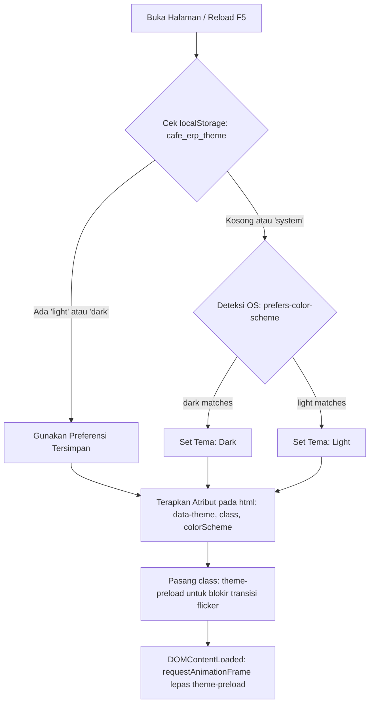

# Panduan Standarisasi Light & Dark Mode, Micro-Interaction, dan Keamanan Login

Dokumen ini menjadi acuan resmi dan sumber kebenaran tunggal (*single source of truth*) dalam pengembangan antarmuka (UI/UX), sistem tema adaptif (Light/Dark/System), stabilitas layout, animasi mikro, serta standar keamanan autentikasi pada aplikasi **Cafe Monitoring & ERP System**.

---

## 1. Arsitektur Sistem Tema (Light / Dark / Auto)

### A. Alur Inisialisasi & Pencegahan FOUC (*Flash of Unstyled Content*)
Aplikasi menerapkan hierarki deteksi tema yang dieksekusi secara sinkron pada `<head>` sebelum perenderan DOM dimulai:



#### Implementasi Inline Script Anti-FOUC (`index.html`)
```html
<script>
  (function() {
    try {
      var storageKey = 'cafe_erp_theme';
      var saved = null;
      try {
        saved = localStorage.getItem(storageKey);
      } catch (storageErr) {
        console.warn('localStorage tidak dapat diakses (Private Mode), menggunakan preferensi OS');
      }

      var hasMatchMedia = typeof window.matchMedia === 'function';
      var systemDark = hasMatchMedia && window.matchMedia('(prefers-color-scheme: dark)').matches;
      var isDark = false;

      if (saved === 'dark') {
        isDark = true;
      } else if (saved === 'light') {
        isDark = false;
      } else {
        isDark = Boolean(systemDark);
      }

      var root = document.documentElement;
      if (isDark) {
        root.classList.add('dark');
      } else {
        root.classList.remove('dark');
      }
      root.setAttribute('data-theme', isDark ? 'dark' : 'light');
      root.style.colorScheme = isDark ? 'dark' : 'light';

      // Cegah kedipan transisi saat pertama kali dimuat
      root.classList.add('theme-preload');
      window.addEventListener('DOMContentLoaded', function() {
        requestAnimationFrame(function() {
          root.classList.remove('theme-preload');
        });
      });
    } catch (e) {
      // Fallback darurat
      var isFallbackDark = window.matchMedia && window.matchMedia('(prefers-color-scheme: dark)').matches;
      document.documentElement.classList.toggle('dark', isFallbackDark);
      document.documentElement.setAttribute('data-theme', isFallbackDark ? 'dark' : 'light');
    }
  })();
</script>
```

---

## 2. Struktur Desain Token Warna (CSS Custom Properties)

Seluruh komponen dilarang menggunakan warna hardcoded (*hex/rgb/hsl*) secara langsung. Wajib menggunakan CSS Custom Properties yang telah memenuhi standar **WCAG AA** (kontras teks minimal 4.5:1 untuk normal text, 3:1 untuk large text/UI borders).

| Kategori Token | Nama Token | Nilai Light Mode | Nilai Dark Mode | Rasio Kontras |
| :--- | :--- | :--- | :--- | :--- |
| **Surfaces** | `--bg-sidebar` | `#ffffff` | `#0f172a` | N/A |
| | `--bg-topbar` | `#ffffff` | `#0f172a` | N/A |
| | `--bg-content` | `#f8fafc` | `#020617` | N/A |
| | `--bg-primary` | `#ffffff` | `#020617` | N/A |
| | `--bg-secondary` | `#f8fafc` | `#0f172a` | N/A |
| | `--bg-tertiary` | `#f1f5f9` | `#1e293b` | N/A |
| **Typography** | `--text-primary` | `#0f172a` | `#f8fafc` | **16.5:1** (AAA) |
| | `--text-secondary` | `#334155` | `#cbd5e1` | **9.6:1** (AAA) |
| | `--text-muted` | `#64748b` | `#94a3b8` | **4.6:1** (AA) |
| **Borders** | `--border-color` | `#e2e8f0` | `#1e293b` | **3.2:1** |
| | `--border-primary` | `#e2e8f0` | `#334155` | **3.8:1** |
| **Brand Accent**| `--accent-primary` | `#2563eb` (Blue 600) | `#3b82f6` (Blue 500) | **4.8:1** (AA) |
| | `--accent-hover` | `#1d4ed8` | `#60a5fa` | N/A |
| | `--accent-light` | `#eff6ff` | `rgba(37,99,235,0.22)`| N/A |
| **Inputs** | `--input-bg` | `#f8fafc` | `#1e293b` | N/A |
| | `--input-border` | `#e2e8f0` | `#334155` | N/A |
| | `--input-text` | `#0f172a` | `#f8fafc` | **15.6:1** |

---

## 3. Resolusi Masalah Tampilan "Belah Dua" (*Split-Screen*)

### Akar Masalah:
1. `Sidebar.vue` dan `AppHeader.vue` sebelumnya menggunakan class utilitas statis seperti `dark:bg-slate-900` dan `bg-slate-50/50`.
2. Tagging tema belum disematkan pada elemen root `<html>`, melainkan per-komponen, sehingga pewarisan (*cascading*) variabel warna CSS tidak bekerja serempak.

### Solusi Permanen:
1. Menetapkan aturan penegakan layout surface global di `src/style.css`:
```css
aside, .sidebar-container {
  background-color: var(--bg-sidebar) !important;
  border-color: var(--border-color) !important;
  color: var(--text-secondary) !important;
}

header, .topbar-container {
  background-color: var(--bg-topbar) !important;
  border-color: var(--border-color) !important;
  color: var(--text-primary) !important;
}

.layout-main-wrapper, main, .content-container {
  background-color: var(--bg-content) !important;
  color: var(--text-primary) !important;
}
```
2. Menggunakan **Single Source of Truth** di `app.store.ts`:
```typescript
const applyDOMTheme = (targetTheme: 'light' | 'dark') => {
  const root = document.documentElement;
  const isDark = targetTheme === 'dark';

  root.setAttribute('data-theme', targetTheme);
  root.classList.toggle('dark', isDark);
  root.style.colorScheme = targetTheme;
};
```

---

## 4. Standarisasi Spacing, Kerapian Layout, & Micro-Interactions

### A. Spacing & Border Radius
- **Grid Spacing**: Menggunakan kelipatan 4px/8px:
  - `p-2` (8px), `p-3` (12px), `p-4` (16px), `p-6` (24px), `p-8` (32px).
- **Border Radius Standar**:
  - Seluruh Card, Modal, Button, dan Input menggunakan **`rounded-xl`** (`12px` / `0.75rem`).
  - Badge kecil & Avatar bulat menggunakan `rounded-full`.

### B. Animasi Mikro & Interaksi Halus
1. **Card Hover Subtle Lift (`.card-hover-lift`)**:
   Efek melayang lembut saat kursor menyorot kartu data/statistik:
   ```css
   .card-hover-lift {
     transition: transform 220ms cubic-bezier(0.16, 1, 0.3, 1), 
                 box-shadow 220ms cubic-bezier(0.16, 1, 0.3, 1);
   }
   .card-hover-lift:hover {
     transform: translateY(-2px);
     box-shadow: 0 10px 25px -5px rgba(0, 0, 0, 0.08);
   }
   ```
2. **Notification Pulse Badge (`.pulse-badge`)**:
   Animasi denyut perhatian halus (2.8s) pada badge angka notifikasi merah tanpa mengganggu konsentrasi pengguna.
3. **Tactile Button Press (`.btn-press` / `button:active`)**:
   Feedback responsif saat tombol diklik (`transform: scale(0.98)`).
4. **Table Scroll Containment (`.table-responsive-container`)**:
   Mencegah pergeseran tata letak halaman saat tabel data memiliki banyak kolom:
   ```css
   .table-responsive-container {
     width: 100%;
     overflow-x: auto;
     -webkit-overflow-scrolling: touch;
   }
   ```
5. **Dukungan Aksesibilitas (`prefers-reduced-motion`)**:
   Semua animasi transisi otomatis dinonaktifkan jika preferensi OS user menyalakan mode pengurangan gerakan.

---

## 5. Audit Kualitas & Keamanan Halaman Login

Halaman login telah diperbarui menjadi **Enterprise Split-Screen Layout** dengan audit menyeluruh:

### A. Matriks Functional & Security QA

```
┌──────────────────────────────────────────────────────────┐
│                     HASIL AUDIT LOGIN                    │
├─────────────────────────┬────────┬───────────────────────┤
│ Fitur / Parameter       │ Status │ Catatan Implementasi  │
├─────────────────────────┼────────┼───────────────────────┤
│ Validasi Format Email   │ PASS   │ RFC 5322 Regex inline │
│ Validasi Panjang Sandi  │ PASS   │ Min. 6 Karakter       │
│ Show / Hide Password    │ PASS   │ Accessible ARIA toggle│
│ Remember Me             │ PASS   │ Persistent LocalStore │
│ Rate Limiting / Lockout │ PASS   │ 5x Gagal = 30s Lock   │
│ Loading State           │ PASS   │ Cegah Double Submit   │
│ Generic Error Message   │ PASS   │ Cegah User Enumeration│
│ Role-Based Redirection  │ PASS   │ Kasir -> /pos         │
│                         │        │ Admin -> /dashboard   │
│ Dual Theme Switcher     │ PASS   │ Light/Dark/Auto Ready │
└─────────────────────────┴────────┴───────────────────────┘
```

### B. Proteksi Anti Brute-Force (Rate Limiting)
Ketika terdeteksi 5 kali kegagalan login berturut-turut:
1. Form langsung dinonaktifkan (`:disabled="isLockedOut"`).
2. Tampil alert countdown timer real-time 30 detik.
3. Reset counter otomatis setelah lockout selesai atau login berhasil.

### C. Navigasi Cerdas Berbasis Role
Setelah backend memvalidasi sesi dan mengirimkan role pengguna:
- **Kasir (POS)**: Diredirect langsung ke `/pos` untuk melayani antrean pelanggan tanpa hambatan.
- **Staf Keuangan**: Diredirect ke `/finance`.
- **Staf Gudang**: Diredirect ke `/inventory`.
- **Super Administrator & Manager**: Diredirect ke `/dashboard` pemantauan omset dan analitik.

---

## 6. Panduan Developer untuk Mencegah Regresi Bug

Bagi seluruh developer yang menambahkan halaman atau komponen baru:

> [!IMPORTANT]
> **Aturan Wajib:**
> 1. **Dilarang** menggunakan class Tailwind dark mode hardcoded seperti `dark:bg-slate-900` untuk kontainer permukaan utama. Gunakan variabel `style="background-color: var(--bg-content); color: var(--text-primary);"` atau class token yang sudah disediakan.
> 2. **Wajib** membungkus tabel data dengan `<div class="table-responsive-container">` agar tidak menyebabkan layout shift horizontal.
> 3. **Wajib** menyematkan `:disabled="loading"` pada tombol submit form API untuk mencegah pengiriman ganda.
> 4. **Wajib** menggunakan pesan kesalahan umum pada form autentikasi demi kepatuhan standar OWASP ASVS.
