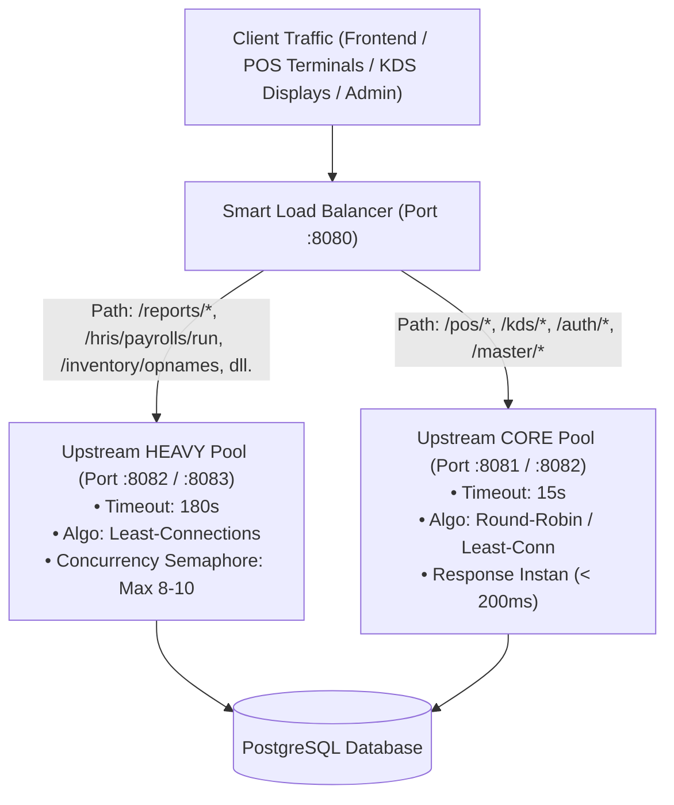

# Arsitektur & Implementasi Load Balancer - Cafe ERP System

Dokumen ini menjelaskan strategi audit API, klasifikasi beban kerja (*workload classification*), dan implementasi **Layer-7 Dual-Pool Load Balancer** pada sistem Cafe ERP.

---

## 1. Latar Belakang & Masalah

Pada arsitektur monolitik tunggal (*single instance*), seluruh permintaan HTTP diproses oleh satu proses dan satu koneksi pool database:
- **Kasir (POS)** membutuhkan respons secepat kilat (< 200ms) untuk pemesanan & cetak struk.
- **Dapur (KDS)** melakukan *polling* otomatis setiap 3–5 detik untuk memperbarui tiket pesanan.
- **Manajemen** sering kali menarik laporan penjualan (*sales report*) bulanan atau tahunan, menjalankan *batch payroll* karyawan, atau melakukan audit stok opname.

**Risiko Utama:**
Ketika satu kueri agregasi laporan berat dieksekusi (memindai puluhan ribu baris transaksi dan *order items*), kueri tersebut memakan koneksi PostgreSQL pool dan CPU worker thread. Akibatnya, kasir dan layar KDS mengalami *freeze*, *latency spike*, atau bahkan *gateway timeout*.

---

## 2. Hasil Audit & Klasifikasi Endpoint API

Setelah mengaudit seluruh **117 endpoint** di backend Cafe ERP, endpoint dikelompokkan ke dalam 3 tier beban:



### 🔴 Group 1: Heavy APIs (Wajib Masuk Pool Khusus & Diisolasi)

Endpoint berikut memiliki komputasi tinggi, melakukan pemindaian tabel besar (*full table scans*), kalkulasi relasional ganda, atau *batch transaction write*:

| Endpoint | HTTP | Karakteristik Beban & Bottleneck |
| :--- | :--- | :--- |
| `/api/v1/reports/sales` | `GET` | Agregasi multi-dimensi tabel `orders` dan `order_items`, *hourly heatmap 24 jam*, produk terlaris, persentase pertumbuhan. |
| `/api/v1/reports/financial` | `GET` | Menghitung Laba Rugi (P&L), COGS/HPP dari mutasi bahan baku, beban gaji karyawan, *gross margin*, dan metrik arus kas. |
| `/api/v1/reports/inventory` | `GET` | Valuasi seluruh stok bahan baku, *slow-moving items*, selisih variansi stok, dan biaya pemborosan (*waste*). |
| `/api/v1/reports/hr` | `GET` | *Join* multi-tabel antara data karyawan, departemen, jadwal shift, log absensi, dan histori penggajian. |
| `/api/v1/reports/custom` | `POST` | *Dynamic query engine* dengan filter dan *group-by* dinamis yang rentan mengeksekusi kueri berat. |
| `/api/v1/hris/payrolls/run` | `POST` | *Batch loop* pemrosesan gaji seluruh karyawan aktif, kalkulasi lembur, potongan PPh 21 tarif progresif, dan BPJS. |
| `/api/v1/hris/payrolls/batch-approve` | `POST` | Pembaruan massal ribuan baris sekaligus mencatat transaksi jurnal akuntansi *double-entry*. |
| `/api/v1/inventory/opnames` | `POST` / `GET` | Audit stok fisik vs stok sistem untuk seluruh inventaris dan pembuatan jurnal pergerakan koreksi (*stock movements*). |
| `/api/v1/inventory/stock-movements` | `GET` | Kueri buku besar mutasi stok yang terus tumbuh secara *append-only*. |
| `/api/v1/finance/reconciliation/match` | `POST` | Pencocokan otomatis mutasi rekening koran bank dengan baris jurnal umum sistem. |

---

### 🟡 Group 2: Latency-Critical & Real-Time APIs (Prioritas Tinggi)

Endpoint operasional yang **tidak boleh terganggu** oleh proses laporan:

| Endpoint | HTTP | Frekuensi / Toleransi Latensi |
| :--- | :--- | :--- |
| `/api/v1/kds/tickets` | `GET` | Dipanggil setiap 3–5 detik oleh layar dapur & barista. Latensi target: < 100ms. |
| `/api/v1/pos/orders/active` | `GET` | Polling meja aktif dan kasir. |
| `/api/v1/pos/orders/{id}/pay` | `POST` | Transaksi pembayaran & penutupan meja. Memotong stok resep dan mencatat kasir. |
| `/api/v1/pos/orders` | `POST` | Pembuatan pesanan pelanggan dan tiket pesanan dapur. |

---

### 🟢 Group 3: Light CRUD & Authentication

Operasi cepat terindeks tunggal berdasarkan ID:
- `/api/v1/auth/login`, `/refresh`, `/profile`
- `/api/v1/master/products`, `/categories`, `/tables`, `/users`, `/branches`

---

## 3. Implementasi Solusi

Sistem ini menerapkan perlindungan berlapis:

### Layer 1: Application-Level In-Flight Concurrency Limiter
File: `backend/internal/delivery/http/middleware/heavy_limiter.go`
- Menggunakan Go Channel Semaphore (`HeavyRouteLimiter`).
- Membatasi jumlah kueri berat yang boleh berjalan bersamaan pada satu instance (default: 8-10 request).
- Jika kapasitas penuh dan timeout antrean (2 detik) tercapai, server mengembalikan status `HTTP 429 Too Many Requests` tanpa membuat database PostgreSQL *crash*.

### Layer 2: Dual-Pool Smart Reverse Proxy / Load Balancer
Tersedia dua opsi deployment:

#### Opsi A: Native Go Load Balancer (Zero Dependency - Windows & Dev Ready)
File: `backend/cmd/loadbalancer/main.go`
- Tidak memerlukan instalasi Nginx atau Docker di Windows.
- Menjalankan inspeksi path URL (L7) secara otomatis.
- Dilengkapi **Least-Connection Balancing** dan **Automatic Background Health Checks**.
- Dashboard metrik langsung di `http://localhost:8080/lb-status`.

#### Opsi B: Production Nginx Load Balancer
File: `deploy/loadbalancer/nginx.conf` & `docker-compose.cluster.yml`
- Menggunakan Nginx upstream pools: `backend_core` (Port 8081, 8082) dan `backend_heavy` (Port 8083).
- Timeout terpisah: 15s untuk Core, 180s untuk Heavy.
- Buffer dinamis untuk menangani ekspor laporan berukuran besar.

---

## 4. Panduan Menjalankan

### Cara 1: Menjalankan di Windows (Satu Perintah)
Gunakan skrip PowerShell yang telah disediakan:

```powershell
# Jalankan cluster (Port 8080, 8081, 8082)
.\scripts\start_load_balancer.ps1
```
Atau cukup klik dua kali berkas:
`scripts\start_load_balancer.bat`

Untuk menghentikan seluruh worker:
```powershell
.\scripts\stop_load_balancer.ps1
```

### Cara 2: Menjalankan Menggunakan Docker Compose (Linux / Production)
```bash
docker compose -f docker-compose.cluster.yml up -d --build
```

---

## 5. Verifikasi & Pemantauan Status

Setelah Load Balancer aktif di port `8080`, periksa status dengan memanggil endpoint:

```bash
curl http://localhost:8080/lb-status
```

Contoh keluaran JSON:
```json
{
  "system": "Cafe ERP Smart Load Balancer",
  "timestamp": "2026-10-04T11:00:00+07:00",
  "pools": {
    "core": [
      { "url": "http://127.0.0.1:8081", "healthy": true, "active_conns": 2, "total_served": 1420 }
    ],
    "heavy": [
      { "url": "http://127.0.0.1:8082", "healthy": true, "active_conns": 0, "total_served": 48 }
    ]
  },
  "heavy_routed_endpoints": [
    "/api/v1/reports",
    "/api/v1/hris/payrolls/run",
    "/api/v1/hris/payrolls/batch-approve",
    "/api/v1/inventory/opnames",
    "/api/v1/inventory/stock-movements",
    "/api/v1/finance/reconciliation/match"
  ]
}
```
Setiap kali request diproses, response header menyertakan tag routing:
- `X-Load-Balancer-Route: CORE` (atau `CORE-POOL`)
- `X-Load-Balancer-Route: HEAVY` (atau `HEAVY-POOL`)
