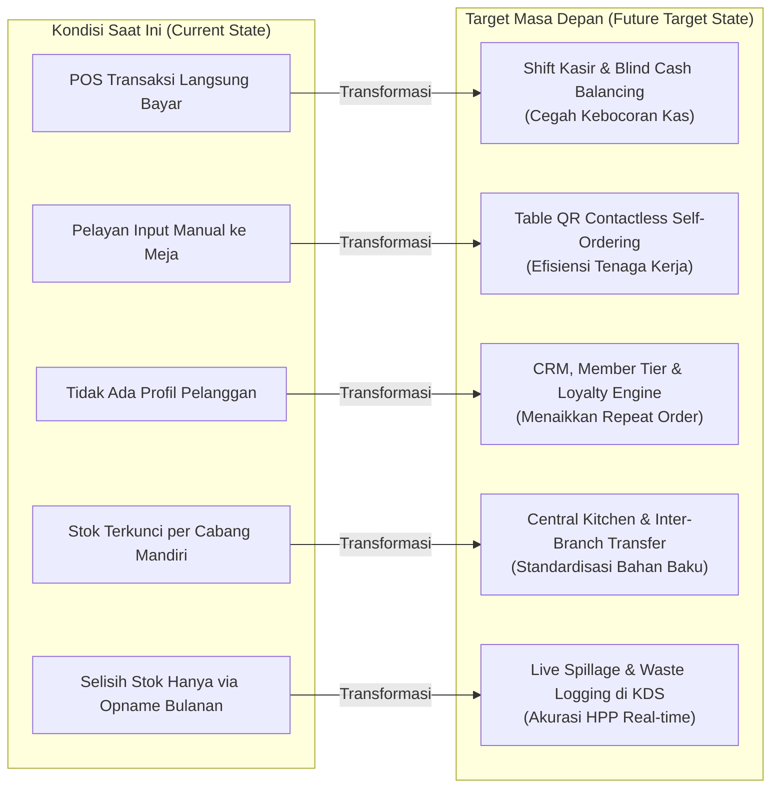
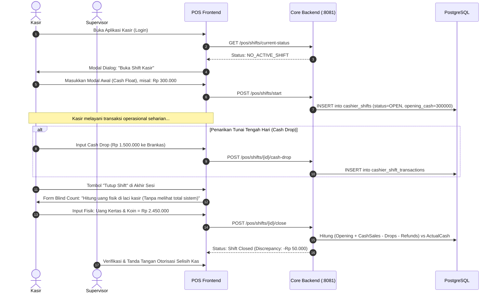
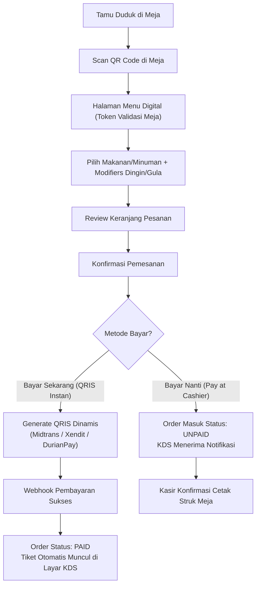
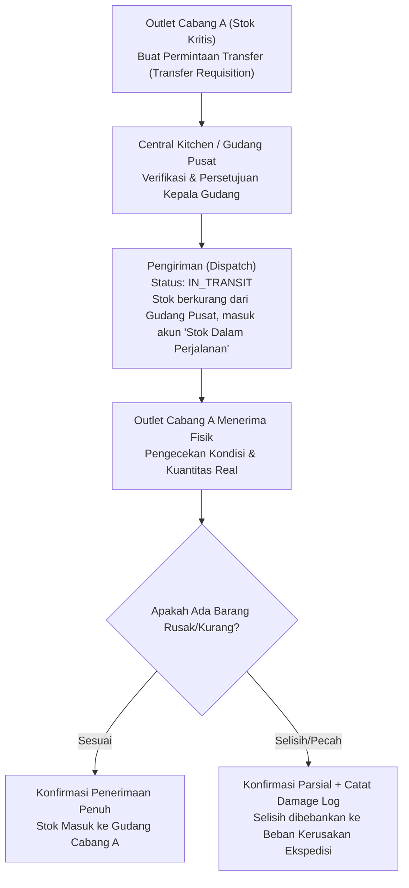
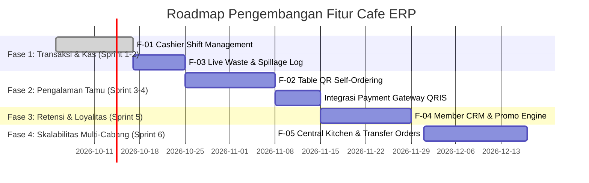

# Product Requirement Document (PRD)
# Rekomendasi Pengembangan Fitur & Alur Operasional Sistem
## Cafe ERP Management System

| Metadata | Keterangan |
| :--- | :--- |
| **Dokumen ID** | `PRD-CERP-2026-V1` |
| **Status** | `Draft / Proposed` |
| **Versi** | `1.0.0` |
| **Tanggal Pembuatan** | 04 Oktober 2026 |
| **Target Sistem** | Backend Go (Chi) & Frontend Vue 3 (Vite + Tailwind CSS) |
| **Klasifikasi Audiens** | Product Manager, Lead Engineer, UI/UX Designer, F&B Business Owner |

---

## 1. Ringkasan Eksekutif (*Executive Summary*)

Saat ini, **Cafe ERP Management System** telah memiliki pondasi sistem operasional yang solid, mencakup:
- **POS & KDS**: Transaksi kasir, pemesanan meja/takeaway, dan antrean layar dapur.
- **Inventory & P2P**: Manajemen stok bahan baku, resep BOM, Purchase Order, hingga GRN.
- **HRIS & Payroll**: Absensi, shift kerja, pengajuan cuti, dan perhitungan gaji PPh 21/BPJS.
- **Finance & Accounting**: Buku besar, jurnal akuntansi *double-entry*, petty cash, dan rekonsiliasi bank.
- **Smart Load Balancer**: Isolasi beban trafik *Core (Real-time)* dan *Heavy (Reporting/Batch)*.

Meskipun demikian, dalam operasional industri F&B (kafe, *specialty coffee*, dan *quick-service restaurant*) modern, terdapat kesenjangan operasional (*operational gap*) yang perlu diisi agar sistem mampu mendukung ekspansi multi-cabang, meningkatkan nilai rata-rata transaksi (*Average Order Value*), dan mencegah kebocoran kasir serta pemborosan bahan baku (*inventory shrinkage*).

Dokumen PRD ini menyajikan **5 Inisiatif Fitur Utama** yang dirancang secara terperinci mencakup alur proses bisnis, diagram arsitektur, kebutuhan database, spesifikasi API, dan kriteria penerimaan (*acceptance criteria*).

---

## 2. Analisis Kesenjangan (*Gap Analysis*) & Tujuan Bisnis



### Tujuan Bisnis (*Business Objectives*):
1. **Zero Cash Discrepancy Risk**: Mencegah selisih uang kasir melalui sistem serah terima shift (*cash float & blind closing*).
2. **Labor Efficiency & Speed of Service**: Mengurangi waktu tunggu pemesanan hingga 40% dengan pemesanan mandiri via QR meja.
3. **Customer Retention Growth**: Meningkatkan frekuensi kunjungan pelanggan sebesar 25% melalui poin loyalitas dan promo otomatis.
4. **Supply Chain Centralization**: Mendukung skala multi-outlet dengan memusatkan persiapan bahan baku di *Central Kitchen*.
5. **Real-time Cost of Goods Sold (COGS) Accuracy**: Mencatat bahan yang tumpah/rusak (*spoilage/waste*) secara instan.

---

## 3. Matriks Prioritas Fitur (MoSCoW & RICE Scoring)

| Inisiatif Fitur | Prioritas | Reach | Impact | Confidence | Effort | RICE Score | Kategori Alur |
| :--- | :---: | :---: | :---: | :---: | :---: | :---: | :--- |
| **F-01: Cashier Shift Management & Cash Float Balancing** | **Must-Have (P1)** | 100% Kasir | High (4) | 90% | Medium (3) | **120** | POS & Finance |
| **F-02: Table QR Self-Ordering (Contactless Menu)** | **Must-Have (P1)** | 100% Tamu | Very High (5) | 85% | High (4) | **106** | Guest & POS/KDS |
| **F-03: Waste, Spillage & Damaged Goods Tracking** | **Should-Have (P2)** | Operasional | High (4) | 90% | Low (2) | **180** | Inventory & KDS |
| **F-04: Customer Loyalty, Membership & Promo Engine** | **Should-Have (P2)** | Pelanggan | High (4) | 80% | High (4) | **80** | Marketing & POS |
| **F-05: Central Kitchen & Inter-Branch Transfer Orders** | **Could-Have (P3)** | Multi-Cabang | Very High (5) | 75% | Very High (5) | **75** | Supply Chain |

---

## 4. Spesifikasi Detail Fitur

---

### FITUR 1: Cashier Shift Management & Blind Cash Drawer Balancing (F-01)

#### 1.1 Masalah & Kebutuhan
Saat ini, kasir dapat langsung menerima pembayaran tanpa adanya validasi sesi kerja (*shift*). Ketika terjadi pergantian kasir atau tutup toko, tidak ada proses pencatatan modal awal tunai (*cash float*), setoran kas tengah hari (*cash drop*), maupun penghitungan buta (*blind closing*). Hal ini menimbulkan potensi selisih uang fisik yang tidak terlacak.

#### 1.2 User Journey & Alur Kerja


#### 1.3 Kebutuhan Data (Schema Relasional)
```sql
CREATE TABLE cashier_shifts (
    id UUID PRIMARY KEY DEFAULT gen_random_uuid(),
    branch_id UUID NOT NULL REFERENCES branches(id),
    cashier_user_id UUID NOT NULL REFERENCES users(id),
    supervisor_user_id UUID REFERENCES users(id),
    shift_name VARCHAR(50) NOT NULL, -- "Shift Pagi", "Shift Sore"
    opened_at TIMESTAMP WITH TIME ZONE DEFAULT NOW(),
    closed_at TIMESTAMP WITH TIME ZONE,
    opening_cash_float NUMERIC(15,2) NOT NULL DEFAULT 0,
    expected_cash_total NUMERIC(15,2) DEFAULT 0,
    actual_cash_counted NUMERIC(15,2) DEFAULT 0,
    cash_difference NUMERIC(15,2) DEFAULT 0, -- actual - expected
    total_sales_cash NUMERIC(15,2) DEFAULT 0,
    total_sales_non_cash NUMERIC(15,2) DEFAULT 0,
    total_cash_drop NUMERIC(15,2) DEFAULT 0,
    total_refunds NUMERIC(15,2) DEFAULT 0,
    status VARCHAR(20) NOT NULL DEFAULT 'OPEN', -- 'OPEN', 'CLOSED', 'AUDITED'
    notes TEXT,
    created_at TIMESTAMP WITH TIME ZONE DEFAULT NOW()
);

CREATE TABLE cashier_shift_movements (
    id UUID PRIMARY KEY DEFAULT gen_random_uuid(),
    shift_id UUID NOT NULL REFERENCES cashier_shifts(id) ON DELETE CASCADE,
    movement_type VARCHAR(20) NOT NULL, -- 'CASH_DROP', 'PAID_OUT', 'CASH_IN'
    amount NUMERIC(15,2) NOT NULL,
    reason VARCHAR(255) NOT NULL,
    authorized_by UUID REFERENCES users(id),
    created_at TIMESTAMP WITH TIME ZONE DEFAULT NOW()
);
```

#### 1.4 API Endpoints
- `GET /api/v1/pos/shifts/current` *(Pool: CORE)*: Mengecek apakah kasir yang login sedang memiliki shift aktif.
- `POST /api/v1/pos/shifts/open` *(Pool: CORE)*: Membuka shift baru dengan modal awal.
- `POST /api/v1/pos/shifts/cash-movement` *(Pool: CORE)*: Catat penarikan kas kecil/drop tunai.
- `POST /api/v1/pos/shifts/close` *(Pool: CORE)*: Menutup shift dengan metode *blind count*.
- `GET /api/v1/pos/shifts/{id}/summary` *(Pool: CORE)*: Cetak struk laporan Z-Report kasir.

---

### FITUR 2: Table QR Contactless Self-Ordering (F-02)

#### 2.1 Masalah & Kebutuhan
Pada jam sibuk (*lunch rush* atau *weekend malam*), antrean di kasir menumpuk dan pelayan kewalahan mencatat pesanan dari meja ke meja. Pelanggan menginginkan fleksibilitas memesan langsung dari smartphone mereka tanpa perlu memasang aplikasi native (*PWA / Mobile Web Browser*).

#### 2.2 User Journey & Alur Kerja


#### 2.3 Keamanan QR Token Meja (Anti-Fraud)
Untuk mencegah seseorang yang tidak berada di kafe menembak pesanan palsu menggunakan foto QR lama:
- QR Code Meja tidak berisi URL statis sederhana seperti `/table/5`.
- QR Code Meja menggunakan format:
  `https://cafe.domain/menu?table_id=UUID&token=HMAC_SHA256(table_id + secret + daily_salt)`
- Diperbarui otomatis setiap pergantian tanggal atau di-*regenerate* dari master meja jika diperlukan.

#### 2.4 Kebutuhan Fitur Menu Modifiers
Kopi dan F&B membutuhkan kustomisasi resep detail:
- Pilihan Suhu: *Hot*, *Iced (+Rp 2.000)*
- Pilihan Susu: *Fresh Milk (Default)*, *Oat Milk (+Rp 8.000)* -> **Pengurangan stok resep otomatis beralih ke item Oat Milk!**
- Level Manis: *Normal Sweet*, *Less Sweet (50%)*, *No Sugar*
- Topping: *Espresso Shot (+Rp 5.000)*, *Caramel Sauce (+Rp 4.000)*

---

### FITUR 3: Live Spillage, Waste, & Shrinkage Logging di KDS/Bar (F-03)

#### 3.1 Masalah & Kebutuhan
Bahan baku sering kali terbuang selama operasional (susu basi/pecah saat *frothing*, biji kopi terbuang saat *dialing espresso grinder*, atau kue *display* lewat tanggal kedaluwarsa). Selama ini, kerugian ini baru terdeteksi saat Stok Opname akhir bulan sehingga menyebabkan HPP / COGS bulanan membengkak tanpa rincian penyebab yang jelas.

#### 3.2 Alur Kerja
1. Barista atau Koki membuka tab **"Waste / Spillage"** di layar KDS atau tablet POS.
2. Memilih bahan baku / produk (misal: *Fresh Milk Greenfields*).
3. Memasukkan kuantitas (misal: *500 ml*) dan memilih kategori alasan:
   - `DIALING_WASTE` (Kalibrasi rasa biji kopi harian)
   - `SPILLED_DROPPED` (Tumpah atau terjatuh)
   - `EXPIRED_SPOILED` (Kedaluwarsa / rusak)
   - `WRONG_ORDER_MISTAKE` (Salah pembuatan pesanan)
4. Sistem memotong inventaris gudang cabang terkait secara *real-time* dan otomatis memicu entri jurnal akuntansi beban kerugian:
   - *Debit*: Beban Pemborosan Bahan Baku (*Wastage & Spillage Expense*)
   - *Kredit*: Persediaan Bahan Baku (*Raw Material Inventory*)

#### 3.3 Kebutuhan Data (Schema Relasional)
```sql
CREATE TABLE inventory_waste_logs (
    id UUID PRIMARY KEY DEFAULT gen_random_uuid(),
    branch_id UUID NOT NULL REFERENCES branches(id),
    logged_by UUID NOT NULL REFERENCES users(id),
    inventory_item_id UUID NOT NULL REFERENCES inventory_items(id),
    quantity NUMERIC(12,3) NOT NULL,
    unit_cost NUMERIC(15,2) NOT NULL, -- Nilai HPP saat barang dibuang
    total_loss_cost NUMERIC(15,2) NOT NULL,
    waste_reason VARCHAR(50) NOT NULL, 
    notes TEXT,
    journal_entry_id UUID REFERENCES journal_entries(id),
    created_at TIMESTAMP WITH TIME ZONE DEFAULT NOW()
);
```

---

### FITUR 4: Customer Relationship Management (CRM), Tiering & Promo Engine (F-04)

#### 4.1 Masalah & Kebutuhan
Kasir saat ini hanya melayani transaksi umum (*Walk-in Guest*). Tidak ada riwayat pelanggan setia, data nomor WhatsApp/Email pelanggan, maupun mekanisme promosi otomatis seperti diskon *Happy Hour*, promo paket (*Bundling Combo*), atau pengumpulan poin belanja.

#### 4.2 Spesifikasi Poin & Tiering Anggota (*Member Loyalty*)
- **Poin Belanja**: Setiap kelipatan belanja Rp 10.000 mendapatkan 1 Poin (senilai Rp 200 saat ditukarkan).
- **Tier Anggota**:
  - **Bronze**: Pelanggan baru (Akumulasi belanja < Rp 1.000.000).
  - **Silver**: Diskon otomatis 5% untuk semua minuman (Belanja Rp 1.000.000 - Rp 3.000.000).
  - **Gold**: Diskon otomatis 10% + *Free Upsize* (Belanja > Rp 3.000.000).

#### 4.3 Mesin Promosi Dinamis (*Promotion Rules Engine*)
Mendukung 4 tipe promo yang dievaluasi otomatis oleh keranjang POS:
1. **Time-Based Discount (Happy Hour)**: Diskon 20% untuk kategori *Pastry & Coffee* pada hari Senin–Kamis pukul 14:00 – 17:00.
2. **Buy X Get Y (BOGO)**: Beli 2 *Americano*, gratis 1 *Croissant*.
3. **Bundle Combo**: *1 Makanan Utama + 1 Minuman Signature* dipaketkan seharga Rp 55.000 (harga normal Rp 68.000).
4. **Voucher / Promo Code**: Kode voucher diskon nominal atau persentase dengan batas kuota penggunaan.

---

### FITUR 5: Central Kitchen & Inter-Branch Transfer Orders (F-05)

#### 5.1 Masalah & Kebutuhan
Bagi kafe yang berkembang menjadi 3–10 cabang, bahan baku seperti biji kopi panggang (*roasted beans*), saus sirup racikan (*artisan syrup*), dan adonan kue (*dough*) diproduksi di Dapur Pusat (*Central Kitchen*) lalu didistribusikan ke outlet. Saat ini sistem belum memiliki dokumen *Transfer Order* (pengiriman dalam perjalanan / *goods-in-transit*) antar gudang cabang.

#### 5.2 Alur Logistik Multi-Cabang


---

## 5. Rencana Integrasi dengan Smart Load Balancer

Seluruh endpoint baru yang didefinisikan dalam PRD ini akan langsung dipetakan ke dalam arsitektur **Smart Layer-7 Load Balancer** yang telah dibuat:

| Modul / Fitur Baru | Endpoint API | Routing Pool | Alasan Teknis |
| :--- | :--- | :---: | :--- |
| **Shift Kasir** | `GET /pos/shifts/*`<br/>`POST /pos/shifts/*` | **`CORE-POOL`** | Latensi wajib < 100ms agar kasir tidak tertunda saat melayani antrean pelanggan. |
| **QR Self-Ordering** | `GET /guest/menu`<br/>`POST /guest/orders` | **`CORE-POOL`** | Pengunjung membutuhkan respons katalog menu cepat dan *smooth* di browser HP. |
| **Waste Logging** | `POST /inventory/waste` | **`CORE-POOL`** | Transaksi tunggal yang langsung terhubung dengan pemotongan stok instan di dapur. |
| **Promo Engine Evaluator** | `POST /pos/promos/evaluate` | **`CORE-POOL`** | Dihitung secara in-memory saat kasir menambahkan menu ke keranjang belanja. |
| **Audit Laporan Shift (Z-Report)** | `GET /reports/shifts/audit` | **`HEAVY-POOL`** | Melakukan agregasi rekonsiliasi kas historis seluruh kasir dalam rentang periode. |
| **Laporan Kerugian Waste** | `GET /reports/waste-analysis` | **`HEAVY-POOL`** | Analisis tren pemborosan bahan baku bulanan dan korelasi terhadap HPP. |
| **Batch Transfer Antar Cabang** | `POST /inventory/transfers/batch` | **`HEAVY-POOL`** | Transaksi multi-item dengan pembuatan jurnal mutasi persediaan multi-cabang. |

---

## 6. Rencana Implementasi & Roadmap Rilis (Phased Delivery)



### Rincian Tonggak Pencapaian (*Milestones*):
- **Milestone 1 (Fondasi Keamanan Kas & Audit Bahan Baku)**:
  - Peluncuran Fitur Shift Kasir (F-01) & Catat Waste KDS (F-03).
  - Target: Selisih uang kas kasir turun menjadi 0% dan akurasi nilai persediaan meningkat hingga 98%.
- **Milestone 2 (Digitalisasi Meja & Efisiensi Layanan)**:
  - Peluncuran Menu QR Meja Tamu (F-02) & Webhook QRIS Dinamis.
  - Target: Mengurangi waktu tunggu antrean kasir hingga 40%.
- **Milestone 3 (Peningkatan Omzet & Nilai Belanja Rata-Rata)**:
  - Peluncuran Sistem Member, Tiering, dan Promo Happy Hour (F-04).
  - Target: Kenaikan *repeat order* pelanggan sebesar 20-30%.
- **Milestone 4 (Ekspansi Multi-Outlet)**:
  - Peluncuran Central Kitchen & Transfer Orders (F-05).
  - Target: Standardisasi bahan baku dan kontrol stok antar cabang terpusat.

---

## 7. Kriteria Penerimaan Non-Fungsional (*Non-Functional Requirements*)

1. **Keamanan (Security & OWASP)**:
   - Akses pembukaan dan penutupan shift kasir harus divalidasi dengan JWT token dan dicek kesesuaian `branch_id`.
   - Endpoint QR Self-Order harus dilindungi dengan *Rate Limiting* berbasis IP dan sanitasi payload untuk mencegah injeksi pesanan palsu.
2. **Kinerja & Skalabilitas (Performance)**:
   - Response time untuk pembukaan menu QR harus di bawah **300ms** di jaringan seluler 4G.
   - Seluruh kueri analitik laporan pergeseran kas dan pemborosan bahan baku dialihkan ke pool **`HEAVY-BACKENDS`** pada Load Balancer agar tidak mempengaruhi transaksi kasir aktif.
3. **Integritas Transaksi (Data Consistency)**:
   - Setiap mutasi pengurangan bahan baku saat *Waste Logging* wajib berada di dalam satu transaksi database (`pgx.Tx`) bersama dengan pencatatan jurnal umum akuntansinya.
