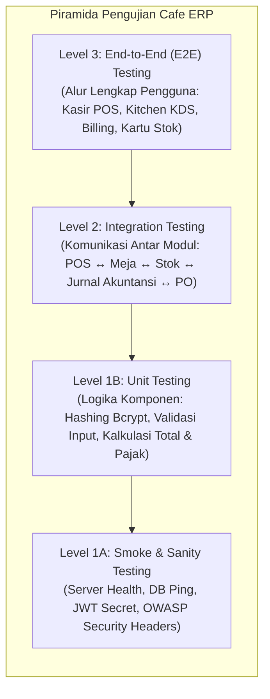
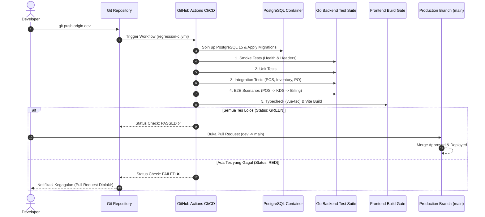

# 🧪 Dokumen Standarisasi Pengujian (Software Testing Standardization)
### Cafe ERP Management System
*Dokumen Resmi Penjaminan Mutu Perangkat Lunak (QA & Testing SOP)*

---

## 📌 1. Latar Belakang & Prinsip Utama

Untuk memastikan keandalan, stabilitas, dan performa tinggi pada sistem **Cafe ERP**, seluruh proses pengembangan perangkat lunak wajib mematuhi standarisasi pengujian berjenjang (*Test Pyramid*). Standarisasi ini menjamin bahwa setiap penambahan fitur baru, perbaikan bug (*hotfix*), atau refactoring kode tidak menimbulkan kerusakan (*regression*) pada modul-modul yang sudah ada sebelumnya.

---

## 📐 2. Piramida & Hirarki Pengujian (*Testing Pyramid*)



| Tingkatan Pengujian | Cakupan & Definisi | Target Waktu | Lokasi File |
| :--- | :--- | :--- | :--- |
| **Level 1A: Smoke / Sanity Testing** | Pengujian cepat sebelum pengujian mendalam. Memverifikasi endpoint `/health`, koneksi PostgreSQL, header keamanan OWASP (`CSP`, `HSTS`, `X-Frame-Options`), dan kesiapan endpoint otentikasi. | < 5 detik | [`backend/tests/smoke/smoke_test.go`](file:///D:/Project/cafe-erp-system/backend/tests/smoke/smoke_test.go) |
| **Level 1B: Unit Testing** | Menguji fungsi individual dan logika bisnis murni secara terisolasi tanpa efek samping database/jaringan (e.g. hashing password, validasi struct). | < 2 detik | [`backend/pkg/crypto/password_test.go`](file:///D:/Project/cafe-erp-system/backend/pkg/crypto/password_test.go) |
| **Level 2: Integration Testing** | Menguji sinkronisasi data antar-modul: Transaksi POS $\rightarrow$ Perubahan Status Meja $\rightarrow$ Pemotongan Stok $\rightarrow$ Pencatatan Kartu Stok $\rightarrow$ Jurnal Keuangan; serta Penerimaan PO Pengadaan $\rightarrow$ Penambahan Stok Bahan Baku. | < 10 detik | [`backend/tests/integration/pos_inventory_integration_test.go`](file:///D:/Project/cafe-erp-system/backend/tests/integration/pos_inventory_integration_test.go) |
| **Level 3: End-to-End (E2E) Testing** | Menguji seluruh alur dari kacamata pengguna akhir (User Journeys) melalui antarmuka HTTP API dengan siklus lengkap (Login $\rightarrow$ Pilih Meja & Menu $\rightarrow$ Kirim ke Meja & KDS $\rightarrow$ Bayar $\rightarrow$ Cetak Struk $\rightarrow$ Cek Kartu Stok). | < 15 detik | [`backend/tests/e2e/e2e_scenarios_test.go`](file:///D:/Project/cafe-erp-system/backend/tests/e2e/e2e_scenarios_test.go) |
| **Regression Testing Suite** | Otomatisasi penggabungan seluruh suite (Smoke + Unit + Integration + E2E + Frontend Build) yang dijalankan sebelum commit/merge. | < 45 detik | [`scripts/run_regression.ps1`](file:///D:/Project/cafe-erp-system/scripts/run_regression.ps1)<br>[`scripts/run_regression.sh`](file:///D:/Project/cafe-erp-system/scripts/run_regression.sh) |

---

## 🗂️ 3. Struktur Direktori Pengujian

```text
cafe-erp-system/
├── .github/
│   └── workflows/
│       └── regression-ci.yml        # Otomatisasi CI/CD GitHub Actions
├── backend/
│   ├── pkg/
│   │   └── crypto/
│   │       └── password_test.go     # Unit Test
│   └── tests/
│       ├── smoke/
│       │   └── smoke_test.go        # Level 1: Smoke & Sanity Tests
│       ├── integration/
│       │   └── pos_inventory_integration_test.go # Level 2: Integration Tests
│       └── e2e/
│           └── e2e_scenarios_test.go# Level 3: End-to-End User Journeys
├── frontend/
│   └── src/                         # Typecheck: vue-tsc & vite build
└── scripts/
    ├── run_regression.ps1           # Full Regression Runner (Windows PowerShell)
    └── run_regression.sh            # Full Regression Runner (Linux / Bash / CI)
```

---

## 💻 4. Panduan Eksekusi Pengujian Lokal

### A. Menjalankan Seluruh Regresi (1-Perintah Otomatis)
Gunakan runner script yang telah disediakan:

* **Di Windows (PowerShell)**:
  ```powershell
  powershell -ExecutionPolicy Bypass -File scripts/run_regression.ps1
  ```
* **Di Linux / macOS / CI**:
  ```bash
  chmod +x scripts/run_regression.sh
  ./scripts/run_regression.sh
  ```

### B. Menjalankan Suite Secara Terpisah (Backend Go)

1. **Smoke Testing**:
   ```bash
   cd backend
   go test -v ./tests/smoke/...
   ```
2. **Unit Testing**:
   ```bash
   cd backend
   go test -v ./pkg/...
   ```
3. **Integration Testing**:
   ```bash
   cd backend
   go test -v ./tests/integration/...
   ```
4. **End-to-End (E2E) Testing**:
   ```bash
   cd backend
   go test -v ./tests/e2e/...
   ```

### C. Verifikasi Kualitas Frontend (Vue 3 + TypeScript)
```bash
cd frontend
npx vue-tsc --noEmit   # Verifikasi tipe TypeScript tanpa kompilasi
npm run build          # Verifikasi bundling production
```

---

## 🔄 5. Otomatisasi CI/CD & Aturan Merge Request (`dev` $\rightarrow$ `main`)

Pipeline CI/CD otomatis dikonfigurasi melalui **GitHub Actions** ([`.github/workflows/regression-ci.yml`](file:///D:/Project/cafe-erp-system/.github/workflows/regression-ci.yml)).



### Aturan Perlindungan Branch (*Branch Protection Rules*):
1. Branch `main` diproteksi dari *direct push*.
2. Setiap penggabungan (*merge*) dari `dev` ke `main` **WAJIB** melalui Pull Request.
3. Pull Request hanya dapat disetujui jika seluruh 5 tahapan *Regression Pipeline* berstatus **PASS** (hijau).

---

## 🛡️ 6. Checklist Kesiapan Fitur Baru (Definition of Done)

Sebelum kode baru dimerge ke branch `dev` atau diajukan ke `main`, developer wajib memastikan:
- [x] **Smoke Test**: Endpoint `/health` dan header OWASP tidak terganggu.
- [x] **Unit Test**: Logika baru tercakup dalam test case `*_test.go`.
- [x] **Integration Test**: Jika fitur mengubah status transaksi/stok, pastikan relasi database dan kartu stok teruji.
- [x] **E2E Test**: Alur pengguna end-to-end tidak menghasilkan error HTTP 4xx/5xx.
- [x] **TypeScript Check**: `vue-tsc --noEmit` lolos 0 error.
- [x] **Full Regression Script**: `scripts/run_regression.ps1` (atau `.sh`) lolos 100% hijau.
